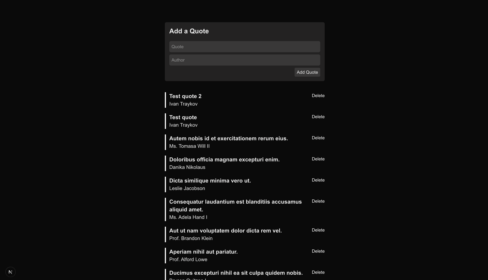

# Quick Quote

A modern quote management application built with Laravel and Next.js. Create, view, and manage inspirational quotes with a clean and intuitive interface.

<div align="center">
  
</div>

## 🚀 Features

-   **Create Quotes**: Add new quotes with optional author attribution
-   **View Quotes**: Browse all quotes in a clean, organized interface
-   **Delete Quotes**: Remove quotes with soft delete functionality
-   **RESTful API**: Well-structured Laravel API with proper validation
-   **Modern Frontend**: Responsive Next.js application with Tailwind CSS
-   **Real-time Updates**: Dynamic quote management without page refreshes

## 🏗️ Project Structure

```
quick-quote/
├── backend/          # Laravel API
│   ├── app/
│   │   ├── Http/Controllers/Api/
│   │   │   └── QuoteController.php
│   │   └── Models/
│   │       └── Quote.php
│   ├── routes/
│   │   └── api.php
│   └── database/
├── frontend/         # Next.js Application
│   ├── src/
│   │   └── app/
│   │       ├── components/
│   │       ├── page.js
│   │       └── layout.js
│   └── package.json
└── README.md
```

## 🛠️ Technology Stack

### Backend (Laravel API)

-   **PHP**: ^8.2
-   **Laravel Framework**: ^12.0
-   **Database**: SQLite (configurable)
-   **Validation**: Built-in Laravel validation
-   **Soft Deletes**: Implemented for quote management

### Frontend (Next.js App)

-   **Node.js**: Modern JavaScript runtime
-   **Next.js**: ^15.3.3 (React framework)
-   **React**: ^19.0.0
-   **Tailwind CSS**: ^4 (Utility-first CSS)
-   **Axios**: ^1.9.0 (HTTP client)

## 📋 Prerequisites

-   **PHP** >= 8.2
-   **Composer** (PHP dependency manager)
-   **Node.js** >= 18
-   **npm** or **bun** (package managers)

## 🚀 Getting Started

### Backend Setup

1. **Navigate to the backend directory**:

    ```bash
    cd backend
    ```

2. **Install PHP dependencies**:

    ```bash
    composer install
    ```

3. **Set up environment**:

    ```bash
    cp .env.example .env
    php artisan key:generate
    ```

4. **Configure database** (edit `.env` file):

    ```env
    DB_CONNECTION=sqlite
    DB_DATABASE=/path/to/your/database.sqlite
    ```

5. **Run migrations**:

    ```bash
    php artisan migrate
    ```

6. **Start the Laravel development server**:
    ```bash
    php artisan serve
    ```
    The API will be available at `http://localhost:8000`

### Frontend Setup

1. **Navigate to the frontend directory**:

    ```bash
    cd frontend
    ```

2. **Install dependencies**:

    ```bash
    npm install
    # or
    bun install
    ```

3. **Start the development server**:
    ```bash
    npm run dev
    # or
    bun run dev
    ```
    The frontend will be available at `http://localhost:3000`

## 📚 API Documentation

### Base URL

```
http://localhost:8000/api
```

### Endpoints

#### Get All Quotes

```http
GET /quotes
```

**Response**:

```json
[
    {
        "id": 1,
        "quote": "The only way to do great work is to love what you do.",
        "author": "Steve Jobs",
        "created_at": "2024-01-01T12:00:00.000000Z",
        "updated_at": "2024-01-01T12:00:00.000000Z"
    }
]
```

#### Get Single Quote

```http
GET /quotes/{id}
```

**Response**:

```json
{
    "id": 1,
    "quote": "The only way to do great work is to love what you do.",
    "author": "Steve Jobs",
    "created_at": "2024-01-01T12:00:00.000000Z",
    "updated_at": "2024-01-01T12:00:00.000000Z"
}
```

#### Create Quote

```http
POST /quotes
```

**Request Body**:

```json
{
    "quote": "Your quote text here",
    "author": "Author Name (optional)"
}
```

**Validation Rules**:

-   `quote`: required, string, min:2, max:255
-   `author`: optional, string, min:2, max:255

#### Delete Quote

```http
POST /quotes/{id}
```

**Response**:

```json
{
    "message": "Quote deleted successfully"
}
```

## 🎨 Frontend Features

### Components

-   **Quote Display**: Clean presentation of quotes and authors
-   **Quote Form**: Form for adding new quotes with validation
-   **Quote List**: Dynamic listing of all quotes
-   **Responsive Design**: Mobile-first approach with Tailwind CSS

### Key Files

-   `src/app/page.js`: Main application page
-   `src/app/layout.js`: Application layout wrapper
-   `src/app/components/`: Reusable React components
-   `src/app/globals.css`: Global styles with Tailwind

## 🧪 Development Commands

### Backend Commands

```bash
# Run tests
php artisan test

# Clear cache
php artisan cache:clear

# List all routes
php artisan route:list

# Run migrations
php artisan migrate

# Rollback migrations
php artisan migrate:rollback
```

### Frontend Commands

```bash
# Development server
npm run dev

# Build for production
npm run build

# Start production server
npm run start

# Lint code
npm run lint
```

## 🔧 Configuration

### Backend Configuration

-   Database settings: `backend/.env`
-   API routes: `backend/routes/api.php`
-   CORS settings: `backend/config/cors.php`

### Frontend Configuration

-   Next.js config: `frontend/next.config.mjs`
-   Tailwind config: `frontend/postcss.config.mjs`
-   ESLint config: `frontend/eslint.config.mjs`

## 🚀 Deployment

### Backend Deployment

1. Configure production database
2. Set `APP_ENV=production` in `.env`
3. Run `composer install --optimize-autoloader --no-dev`
4. Run `php artisan config:cache`
5. Run `php artisan migrate --force`

### Frontend Deployment

1. Run `npm run build`
2. Deploy the `.next` folder to your hosting provider
3. Ensure environment variables are set for API endpoints

## 🤝 Contributing

1. Fork the repository
2. Create a feature branch (`git checkout -b feature/amazing-feature`)
3. Commit your changes (`git commit -m 'Add some amazing feature'`)
4. Push to the branch (`git push origin feature/amazing-feature`)
5. Open a Pull Request

## 📝 License

This project is open source and available under the [MIT License](LICENSE).

## 👥 Authors

-   Ivan Traykov - Initial work

## 🐛 Issues

If you encounter any issues or have suggestions, please file an issue on the GitHub repository.

---

Built with ❤️ using Laravel and Next.js
